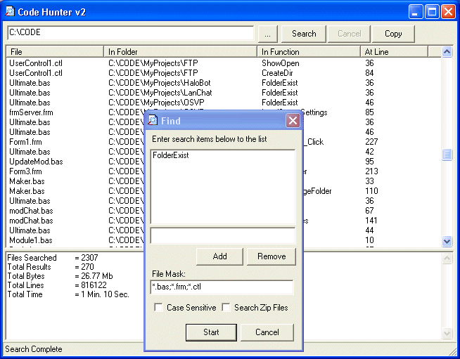



## Code Hunter 2 \(With Zip Search\)

### Description

Its back an better than ever with the ability to now search through zip files, find that elusive piece of code fast! This could also be modified to make a good general search program for anything else... vote if you find it useful, comment if you find bugs. *Updated 11/26/03*
 
### More Info
 

             |
---                |---
**Submitted On**   |2003-11-26 22:11:50
**By**             |[Deth](https://github.com/Planet-Source-Code/PSCIndex/blob/master/ByAuthor/deth.md)
**Level**          |Intermediate
**User Rating**    |5.0 (110 globes from 22 users)
**Compatibility**  |VB 6\.0
**Category**       |[Files/ File Controls/ Input/ Output](https://github.com/Planet-Source-Code/PSCIndex/blob/master/ByCategory/files-file-controls-input-output__1-3.md)
**World**          |[Visual Basic](https://github.com/Planet-Source-Code/PSCIndex/blob/master/ByWorld/visual-basic.md)
**Archive File**   |[Code\_Hunte16766311262003\.zip](https://github.com/Planet-Source-Code/deth-code-hunter-2-with-zip-search__1-50061/archive/master.zip)

